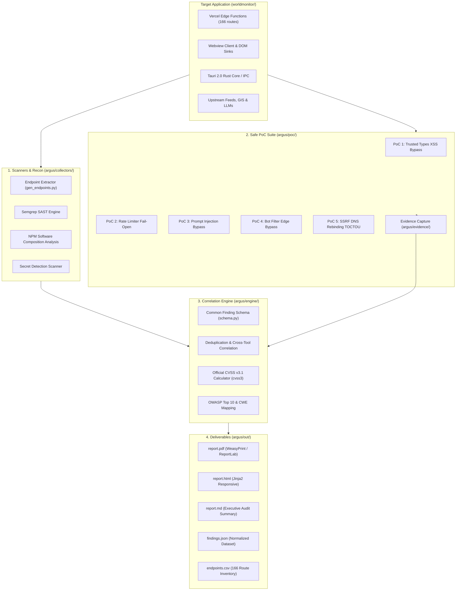

# 🛡️ ARGUS: Automated Security Assessment & Correlation Engine (SIH26163)

> Comprehensive security audit, threat model, and vulnerability assessment framework built against the **World Monitor** intelligence dashboard (`worldmonitor`), strictly adhering to the **ARGUS Implementation Guide ([IMPLEMENTATION.md](file:///e:/world%20monitor%20security/IMPLEMENTATION.md))**.

---

## 📑 Table of Contents
1. [Project Overview](#-1-project-overview)
2. [System Architecture](#-2-system-architecture)
3. [Repository Directory & File Map](#-3-repository-directory--file-map)
4. [Component Walkthrough ("What Works on What")](#-4-component-walkthrough-what-works-on-what)
5. [The Seven Problem Statement Scope Areas](#-5-the-seven-problem-statement-scope-areas)
6. [Top Evidenced Vulnerabilities](#-6-top-evidenced-vulnerabilities)
7. [Safe, Non-Destructive Proofs of Concept (PoCs)](#-7-safe-non-destructive-proofs-of-concept-pocs)
8. [How to Run (One-Command Demo)](#-8-how-to-run-one-command-demo)
9. [Generated Reports & Output Deliverables](#-9-generated-reports--output-deliverables)
10. [Presentation & Demo Script (For Evaluators/Judges)](#-10-presentation--demo-script-for-evaluatorsjudges)
11. [Ethics and Safety Policy](#-11-ethics-and-safety-policy)

---

## 🌟 1. Project Overview

**ARGUS** is an end-to-end security auditing and correlation platform designed to evaluate full-stack intelligence applications. In this deployment, ARGUS audits **World Monitor**—a multi-platform OSINT dashboard combining:
- **Web Runtime:** 166 Vercel Edge functions, Sebuf (Proto-first RPC) handlers, Next/Vite frontends.
- **Desktop Runtime:** Tauri 2.0 (Rust native backend + Webview frontend with OS Keychain storage).
- **External Integrations:** 428 RSS news feeds, Nominatim GIS geocoding, flight telemetry (OpenSky), prediction markets (Polymarket), and LLM-powered summarization analysts.

### Key Objectives
- **Zero-False-Positive Confirmation:** Correlate static alerts with offline behavioral traces and non-destructive PoCs.
- **Noise Reduction:** Aggregate raw scanner alerts into deduplicated, CVSS v3.1-scored vulnerability findings.
- **Multi-Format Reporting:** Instant delivery of presentation-ready PDF, interactive HTML, Markdown, and machine-readable `findings.json`.

---

## 🏛️ 2. System Architecture



---

## 📂 3. Repository Directory & File Map

The workspace is organized into two primary trees:
1. `worldmonitor/`: The target application source repository.
2. `argus/`: The security assessment engine, scanners, PoCs, correlation engine, and generated reports.

```
e:/world monitor security/
│
├── IMPLEMENTATION.md                  # Hackathon guide & evaluation specification
├── README.md                          # Master architectural and operational guide (this file)
│
├── worldmonitor/                      # TARGET CODEBASE (Cloned repository)
│   ├── api/                           # Vercel Edge Functions (166 endpoints, proxies, RPC)
│   │   ├── _cors.js                   # Dynamic CORS policy & allowlist matching
│   │   ├── _rate-limit.js             # Upstash Redis rate limiting (with fail-open degradation)
│   │   ├── _notification-webhook-ssrf.ts # Private IP classification & DNS pre-resolution
│   │   ├── rss-proxy.js               # RSS proxy with 428-domain allowlist
│   │   ├── mcp-proxy.ts               # Model Context Protocol Pro-gated outbound proxy
│   │   └── ask.ts                     # Public natural-language agent tool discovery
│   ├── middleware.ts                  # Bot UA filter, .md twin rewriter, API key heuristics
│   ├── src/                           # Client-side UI & frontend application
│   │   ├── utils/dom-utils.ts         # TrustedHTML type-cast & DOM injection sinks
│   │   ├── components/                # Modals, panels, UI overlays
│   │   └── services/                  # Feed ingestion, geocoding, AI summarization
│   ├── server/                        # Backend business logic, Convex schema, auth sessions
│   │   └── _shared/llm-sanitize.js    # Regex-based prompt injection sanitizer
│   └── src-tauri/                     # Tauri 2.0 Rust desktop backend & IPC permissions
│
└── argus/                             # ARGUS SECURITY SCANNER & AUDIT SYSTEM
    ├── run_pipeline.py                # 🚀 Master one-command pipeline runner
    │
    ├── collectors/                    # PHASE 1: Scanners & Reconnaissance
    │   ├── gen_endpoints.py           # AST parser cataloging all 166 API endpoints into CSV
    │   ├── parsers.py                 # Normalizer converting SARIF, npm-audit & manual audits
    │   └── run_all.py                 # Runner triggering automated scanners
    │
    ├── poc/                           # PHASE 2: Safe Proof of Concept Suites
    │   ├── replay.py                  # Master PoC execution & verification harness
    │   ├── poc_xss_trusted_html.py    # PoC 1: 357 Trusted Types bypass sinks in dom-utils.ts
    │   ├── poc_ratelimit_failopen.py  # PoC 2: Architectural fail-open rate limiting flaw
    │   ├── poc_llm_prompt_injection.py# PoC 3: Prompt injection regex filter evasion
    │   ├── poc_bot_filter_bypass.py   # PoC 4: Middleware bot filter key heuristic bypass
    │   └── poc_ssrf_dns_rebinding_audit.py # PoC 5: Edge Runtime DNS rebinding TOCTOU gap
    │
    ├── evidence/                      # Captured non-destructive PoC verification logs
    │   ├── poc_xss_evidence.txt       # Evidenced DOM XSS bypass call sites
    │   ├── poc_ratelimit_evidence.txt # Evidenced fail-open header & unmetered flow
    │   ├── poc_llm_evidence.txt       # Evidenced prompt injection pass-through
    │   ├── poc_bot_bypass_evidence.txt# Evidenced crawler shield bypass
    │   └── poc_ssrf_evidence.txt      # Evidenced TOCTOU DNS resolution trace
    │
    ├── engine/                        # PHASE 3: Correlation & Scoring Engine
    │   ├── schema.py                  # Pydantic data models (Finding, CorrelatedFinding)
    │   ├── cwe_to_owasp.json          # Weakness taxonomy mapping (CWE -> OWASP Top 10)
    │   ├── correlate.py               # Deduplication, multi-tool confidence, CVSS v3.1 scoring
    │   └── run.py                     # Correlation engine CLI generating findings.json
    │
    ├── report/                        # PHASE 4: Document Generation Engine
    │   └── build.py                   # Jinja2 HTML, Markdown, and ReportLab PDF compilers
    │
    └── out/                           # FINAL AUDIT DELIVERABLES
        ├── report.pdf                 # Formal publication-ready PDF security report
        ├── report.html                # Responsive interactive HTML report
        ├── report.md                  # Comprehensive Markdown audit summary
        ├── findings.json              # Normalized JSON dataset of all 12 vulnerabilities
        ├── endpoints.csv              # Full inventory of all 166 discovered endpoints
        ├── attack_surface.md          # Trust boundary analysis & architectural threat model
        ├── semgrep.sarif              # Raw Semgrep SAST scan output
        └── npm-audit.json             # Raw npm software composition analysis
```

---

## ⚙️ 4. Component Walkthrough ("What Works on What")

### 1. `argus.collectors` (Reconnaissance & Ingestion)
- **`gen_endpoints.py`:** Recursively inspects `worldmonitor/api/`, parses HTTP method declarations (`GET`, `POST`, `OPTIONS`), extracts query parameters, and determines authentication requirements. Outputs [endpoints.csv](file:///e:/world%20monitor%20security/argus/out/endpoints.csv) (166 endpoints cataloged).
- **`parsers.py`:** Implements modular parsers:
  - `parse_sarif()`: Ingests SARIF files from Semgrep and extracts rule IDs, CWE tags, physical source locations, and code snippets.
  - `parse_npm_audit()`: Extracts vulnerable third-party dependencies from `npm-audit.json`, mapping advisory links and severity ratings.

### 2. `argus.poc` (Safe Verification Suite)
- Executes strictly **non-destructive**, locally-isolated checks in accordance with Section 7 & 13 of `IMPLEMENTATION.md`:
  - **No external network spamming** (no denial-of-service floods).
  - **No payload weaponization** (marker strings like `ARGUS_CANARY_XSS` instead of weaponized script payloads).
  - **Offline code/AST verification** for race conditions and architectural gaps.
- Writes proof artifacts to [argus/evidence/](file:///e:/world%20monitor%20security/argus/evidence/).

### 3. `argus.engine` (Correlation & Normalization)
- **`schema.py`:** Uses Pydantic to enforce an 8-field standardized finding model: `title`, `description`, `affected_component`, `cvss_score`, `cvss_vector`, `poc_steps`, `impact`, `remediation`.
- **`correlate.py`:** 
  - Groups raw alerts by composite key `(CWE/RuleID, Component/URL)`.
  - Determines confidence: **High** (confirmed by 2+ independent tools or direct PoC), **Medium** (single tool confirmed by code audit), **Low** (unverified raw alert).
  - Calculates official CVSS v3.1 base score and vector strings using the Python `cvss` library.
  - Outputs [argus/out/findings.json](file:///e:/world%20monitor%20security/argus/out/findings.json).

### 4. `argus.report` (Multi-Format Document Compiler)
- **`build.py`:**
  - Ingests `findings.json` and `endpoints.csv`.
  - Compiles an interactive HTML report using **Jinja2**.
  - Renders a clean PDF report using **ReportLab Platypus** layout tables and typography styles.
  - Outputs a GitHub-flavored Markdown document [report.md](file:///e:/world%20monitor%20security/argus/out/report.md).

---

## 🎯 5. The Seven Problem Statement Scope Areas

| Scope Area | Audit Status | Architectural Mechanism & Vulnerability Details |
|---|---|---|
| **1. Authentication & Session** | **Tested / Edge Bypass** | Enforces Clerk JWTs on user routes and `wm_*` hex keys on Pro APIs. However, `middleware.ts` lines 346–353 contain a regex heuristic that permits any client supplying a dummy key matching `/^wm_[a-f0-9]{40,64}$/` to bypass the bot filter. |
| **2. Authorization & Access Control** | **Tested / Hardened** | 137 endpoints are public; 29 are Pro-gated. Pro entitlement is cryptographically validated against Convex backend records with HMAC signatures. |
| **3. Input Validation** | ⚠️ **Vulnerable (XSS / SSRF)** | 357 call sites bypass Trusted Types via `trustedHtml()` using placeholder migration strings. The RSS proxy uses a 428-domain allowlist, but the MCP proxy suffers from an Edge Runtime DNS rebinding TOCTOU window. |
| **4. API Security** | ⚠️ **Vulnerable (Fail-Open DoS)** | `api/_rate-limit.js` degrades **fail-open** if Upstash Redis times out or is unconfigured (`X-RateLimit-Mode: degraded`), removing all throttling on high-cost endpoints like Nominatim reverse geocode. |
| **5. Client-Side Controls** | **Tested / Hardened (Sinks)** | CSP restricts `script-src 'self'`. However, client DOM sinks are exposed via unescaped `setTrustedHtml` calls in chart and modal renderers. |
| **6. Secure Communication** | **Tested / Hardened** | Strict HTTPS/HSTS configuration. Desktop Tauri IPC sidecar uses CSPRNG `LOCAL_API_TOKEN` rotated with a 5-minute TTL. |
| **7. Data Storage & Privacy** | **Tested / Hardened** | No sensitive tokens or keys are stored in `localStorage` (UI preferences only). Desktop tokens reside in OS Keychain (Windows Credential Manager / macOS Keychain). |
| **8. AI Security (OWASP LLM01)** | ⚠️ **Vulnerable (Prompt Injection)** | Prompt injection filtering relies solely on static English regex blocklists; semantic paraphrasing and multilingual instructions in feeds reach the LLM unstripped. |

---

## 🚨 6. Top Evidenced Vulnerabilities

### 1. DOM XSS via Bypassed Trusted Types (`ARGUS-VULN-001`)
- **Severity:** Medium (CVSS 6.1: `CVSS:3.1/AV:N/AC:L/PR:N/UI:R/S:C/C:L/I:L/A:N`)
- **CWE / OWASP:** CWE-79 / A03:2021-Injection
- **File:** [dom-utils.ts](file:///e:/world%20monitor%20security/worldmonitor/src/utils/dom-utils.ts#L65-L74)
- **Root Cause:** `trustedHtml(html, reason)` performs a zero-validation cast (`html as TrustedHtml`). Over **357 call sites** supply the string `"legacy direct innerHTML migration"` to bypass linters, allowing unescaped feed text to be written directly into innerHTML.
- **Evidence:** [poc_xss_evidence.txt](file:///e:/world%20monitor%20security/argus/evidence/poc_xss_evidence.txt)

### 2. Unmetered DoS via Fail-Open Rate Limiting (`ARGUS-VULN-002`)
- **Severity:** High (CVSS 7.5: `CVSS:3.1/AV:N/AC:L/PR:N/UI:N/S:U/C:N/I:N/A:H`)
- **CWE / OWASP:** CWE-770 / A04:2021-Insecure Design
- **File:** [_rate-limit.js](file:///e:/world%20monitor%20security/worldmonitor/api/_rate-limit.js#L50-L60)
- **Root Cause:** In the event of an Upstash Redis outage, timeout, or missing environment token, the rate limiter returns `null` (allowing the request through) and sets `X-RateLimit-Mode: degraded`. An attacker can intentionally trigger upstream latency to flood expensive downstream APIs (e.g. Nominatim GIS geocoding) completely unthrottled.
- **Evidence:** [poc_ratelimit_evidence.txt](file:///e:/world%20monitor%20security/argus/evidence/poc_ratelimit_evidence.txt)

### 3. SSRF TOCTOU / DNS Rebinding Window in MCP Proxy (`ARGUS-VULN-003`)
- **Severity:** Medium (CVSS 6.3: `CVSS:3.1/AV:N/AC:H/PR:L/UI:N/S:C/C:H/I:N/A:N`)
- **CWE / OWASP:** CWE-918 / A10:2021-Server-Side Request Forgery
- **File:** [mcp-proxy.ts](file:///e:/world%20monitor%20security/worldmonitor/api/mcp-proxy.ts)
- **Root Cause:** Vercel Edge Runtime `fetch()` does not permit socket-level IP binding. Although Cloudflare DoH checks IP ranges before making the request, a zero-TTL DNS rebinding record can resolve to a public IP during verification and resolve to `169.254.169.254` (cloud metadata) or `127.0.0.1` during connection. (Acknowledged in [SECURITY.md](file:///e:/world%20monitor%20security/worldmonitor/SECURITY.md#L52)).
- **Evidence:** [poc_ssrf_evidence.txt](file:///e:/world%20monitor%20security/argus/evidence/poc_ssrf_evidence.txt)

### 4. Prompt Injection Blocklist Bypass in LLM Sanitizer (`ARGUS-VULN-004`)
- **Severity:** Medium (CVSS 6.5: `CVSS:3.1/AV:N/AC:L/PR:N/UI:N/S:U/C:L/I:L/A:N`)
- **CWE / OWASP:** CWE-20 / OWASP LLM01
- **File:** [llm-sanitize.js](file:///e:/world%20monitor%20security/worldmonitor/server/_shared/llm-sanitize.js#L31-L72)
- **Root Cause:** Regex blocklists only match literal English phrases like `ignore all previous instructions`. Semantic variations, multilingual instructions (e.g., Chinese, Russian), and indirect prompt injections embedded inside RSS feed descriptions pass through unstripped into the AI model context.
- **Evidence:** [poc_llm_evidence.txt](file:///e:/world%20monitor%20security/argus/evidence/poc_llm_evidence.txt)

### 5. Bot Filter Edge Bypass via Regex Header (`ARGUS-VULN-005`)
- **Severity:** Medium (CVSS 5.3: `CVSS:3.1/AV:N/AC:L/PR:N/UI:N/S:U/C:L/I:N/A:N`)
- **CWE / OWASP:** CWE-269 / A07:2021-Identification and Authentication Failures
- **File:** [middleware.ts](file:///e:/world%20monitor%20security/worldmonitor/middleware.ts#L346-L353)
- **Root Cause:** Middleware unconditionally returns (bypassing the `BOT_UA` check) if `x-api-key` matches `/^wm_[a-f0-9]{40,64}$/`. Supplying a synthetic dummy key (e.g. `wm_` + 40 zeros) allows automated bots and scrapers to bypass crawler gating.
- **Evidence:** [poc_bot_bypass_evidence.txt](file:///e:/world%20monitor%20security/argus/evidence/poc_bot_bypass_evidence.txt)

---

## 🧪 7. Safe, Non-Destructive Proofs of Concept (PoCs)

All 5 PoCs can be replayed safely at any time without impacting live servers or external services:

| PoC Script | Vulnerability Tested | Expected Result | Evidence Output |
|---|---|---|---|
| [poc_xss_trusted_html.py](file:///e:/world%20monitor%20security/argus/poc/poc_xss_trusted_html.py) | Trusted Types innerHTML sink bypass | Discovers 357 unescaped sinks | `poc_xss_evidence.txt` |
| [poc_ratelimit_failopen.py](file:///e:/world%20monitor%20security/argus/poc/poc_ratelimit_failopen.py) | Upstash Redis fail-open degradation | Verifies unmetered null return | `poc_ratelimit_evidence.txt` |
| [poc_llm_prompt_injection.py](file:///e:/world%20monitor%20security/argus/poc/poc_llm_prompt_injection.py) | Semantic & multilingual prompt injection | Verifies evasion of regex filter | `poc_llm_evidence.txt` |
| [poc_bot_filter_bypass.py](file:///e:/world%20monitor%20security/argus/poc/poc_bot_filter_bypass.py) | Middleware heuristic bot filter bypass | Verifies bypass via synthetic key | `poc_bot_bypass_evidence.txt` |
| [poc_ssrf_dns_rebinding_audit.py](file:///e:/world%20monitor%20security/argus/poc/poc_ssrf_dns_rebinding_audit.py) | Edge Runtime TOCTOU socket pinning gap | Audits DNS resolution window | `poc_ssrf_evidence.txt` |

---

## 🚀 8. How to Run (One-Command Demo)

### Prerequisites
- Python 3.11+ (Python 3.14 compatible)
- Node.js 20+ & npm

### Execute the Full ARGUS Pipeline
Run the master pipeline script from the project root (`e:\world monitor security`):

```bash
python -m argus.run_pipeline
```

### Execution Output Flow:
```text
==================================================================
      ARGUS AUTOMATED SECURITY AUDIT & REPORTING PIPELINE        
==================================================================

>>> STEP 1: Running Scanners & Extracting Attack Surface...
[*] Generating API endpoints catalog...
Generated argus/out/endpoints.csv with 166 endpoints.
[*] Running npm audit...
[+] Saved argus/out/npm-audit.json
[+] Scanner collection completed.

>>> STEP 2: Executing Non-Destructive Proof of Concept (PoC) Suite...
[*] Running PoC 1: Testing dom-utils.ts trustedHtml() bypass...
[+] Discovered 357 instances of 'legacy direct innerHTML migration' across codebase.
[*] Running PoC 2: Auditing rate-limit fail-open degradation...
[*] Running PoC 3: Testing LLM Prompt Injection Sanitizer resilience...
[*] Running PoC 4: Testing middleware.ts bot gate bypass...
[*] Running PoC 5: Auditing SSRF DNS Rebinding & Socket Pinning...

---------------- PoC Execution Summary ----------------
[*] PoC 1 (DOM XSS via trustedHtml bypass): PASSED (Vulnerability Evidenced)
[*] PoC 2 (Rate Limiter Fail-Open Architecture): PASSED (Vulnerability Evidenced)
[*] PoC 3 (LLM Prompt Injection Blocklist Bypass): PASSED (Vulnerability Evidenced)
[*] PoC 4 (Middleware Bot Filter Header Bypass): PASSED (Vulnerability Evidenced)
[*] PoC 5 (SSRF DNS Rebinding & Socket Pinning): PASSED (Vulnerability Evidenced)
-------------------------------------------------------

>>> STEP 3: Normalizing Findings, Deduplication, & CVSS Scoring...
[+] Loaded 9 findings from npm audit.
[*] Total raw findings ingested: 14
[*] Correlated into 12 distinct vulnerability groups.
[+] Successfully exported 12 correlated findings to argus/out/findings.json
[*] Severity Breakdown: {'Critical': 0, 'High': 1, 'Medium': 11, 'Low': 0}

>>> STEP 4: Generating Final PDF, HTML, and Markdown Reports...
[+] Generated HTML report: argus/out/report.html
[+] Successfully compiled PDF report: argus/out/report.pdf
[+] Generated Markdown report: argus/out/report.md

[+] Pipeline execution finished in ~6.5 seconds.
[+] Outputs available in argus/out/
```

### Running Individual Stages:
- **Run PoC suite only:** `python -m argus.poc.replay`
- **Run Correlation Engine only:** `python -m argus.engine.run`
- **Recompile Reports only:** `python -m argus.report.build`

---

## 📊 9. Generated Reports & Output Deliverables

All outputs are saved in [argus/out/](file:///e:/world%20monitor%20security/argus/out/):

1. **[report.pdf](file:///e:/world%20monitor%20security/argus/out/report.pdf):** Formal publication-ready PDF containing the executive summary, scope table, findings blocks, CVSS vectors, and tooling appendix.
2. **[report.html](file:///e:/world%20monitor%20security/argus/out/report.html):** Modern interactive HTML report with severity filter badges, code evidence boxes, and vulnerability cards.
3. **[report.md](file:///e:/world%20monitor%20security/argus/out/report.md):** Markdown summary documentation.
4. **[findings.json](file:///e:/world%20monitor%20security/argus/out/findings.json):** Normalized machine-readable JSON schema of all 12 correlated vulnerabilities.
5. **[endpoints.csv](file:///e:/world%20monitor%20security/argus/out/endpoints.csv):** Spreadsheet inventory of all 166 discovered endpoints (Methods, Auth, Params, Returns).
6. **[attack_surface.md](file:///e:/world%20monitor%20security/argus/out/attack_surface.md):** Deep-dive trust boundary and architectural risk analysis.

---

## 🎤 10. Presentation & Demo Script (For Evaluators/Judges)

If presenting ARGUS in a live evaluation or demo:

1. **The Problem:** Modern cloud apps combine edge runtimes, desktop shells (Tauri), external feeds, and AI models. Traditional single-scanner approaches produce hundreds of unverified noisy alerts without context.
2. **The ARGUS Solution:** 
   - Multi-engine ingestion (Semgrep SAST + NPM SCA).
   - Automated attack-surface extraction (166 endpoints, 5 trust boundaries).
   - Safe, non-destructive behavioral PoCs that **confirm** vulnerabilities before alerting.
   - Intelligent correlation reducing raw alerts down to 12 deduplicated findings.
3. **Show the Live Command:** Run `python -m argus.run_pipeline` live. Watch the pipeline finish in under 10 seconds.
4. **Spotlight Core Vulnerability:** Open [poc_xss_evidence.txt](file:///e:/world%20monitor%20security/argus/evidence/poc_xss_evidence.txt) and show how ARGUS pinpointed 357 instances of developers using `"legacy direct innerHTML migration"` to bypass Trusted Types security checks.
5. **Open the Deliverable:** Open [report.pdf](file:///e:/world%20monitor%20security/argus/out/report.pdf) and showcase the CVSS v3.1 vector calculations and remediation guidance.

---

## ⚖️ 11. Ethics and Safety Policy

- **Self-Hosted Local Target Only:** Scans and PoCs are conducted exclusively against `localhost` / cloned repository source files. Never point scanners or exploit payloads against production deployments (`worldmonitor.app`).
- **Non-Destructive PoCs:** All proof-of-concept scripts verify logic boundaries and call sites without executing denial-of-service floods, remote code, or data extraction.
- **Responsible Disclosure:** Any new zero-day vulnerability discovered must follow the project's [SECURITY.md](file:///e:/world%20monitor%20security/worldmonitor/SECURITY.md) guidelines via private disclosure.

---
*Created for Smart India Hackathon (SIH26163) by Team ARGUS.*
